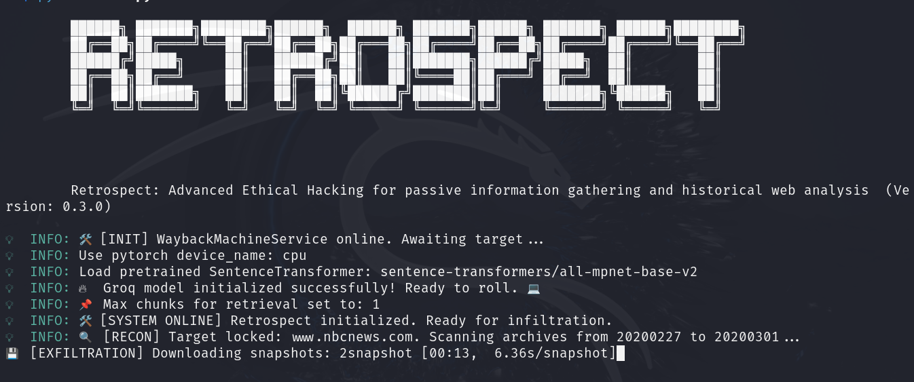
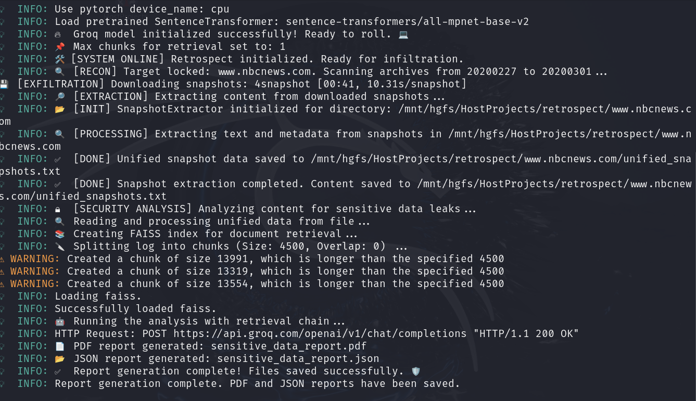
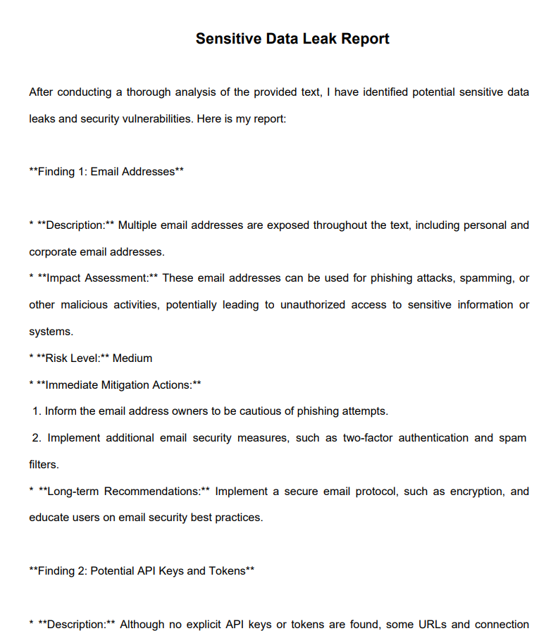

# 🔍 **Retrospect: Unveiling the Past to Secure the Future** 🛡️

**Retrospect** is a revolutionary **cybersecurity tool** 🧰 that excels in **passive information gathering** and **historical web analysis** 🌐. By tapping into the vast archives of the **Wayback Machine** 🕰️ and utilizing **advanced data extraction techniques**, Retrospect offers security professionals unparalleled insights into **digital footprints** 👣, **past vulnerabilities** 🛑, and **evolving security risks** 🚨.

🔐 Whether you're an **ethical hacker** 🕵️‍♂️, a **penetration tester** 🔨, or a **forensic analyst** 🔍, Retrospect is your go-to tool for identifying **exposed sensitive data** 📂, **outdated configurations** 🛠️, and **security misconfigurations** ⚠️ from archived websites. It empowers you to **predict and mitigate potential threats** 🛡️ before they escalate into full-blown exploits. 🚫

By **unlocking the secrets of the past**, Retrospect equips you to **fortify the future** 🔒—helping you stay one step ahead in the ongoing battle against cyber threats. ⚔️

🙏 I would like to express my sincere gratitude to [Santiago Hernández, a leading expert in Cybersecurity and Artificial Intelligence](https://www.udemy.com/user/shramos/). His outstanding course on **Cybersecurity and Ethical Hacking**, available on Udemy, was instrumental in the development of this project. The insights and techniques I gained from his course were invaluable in guiding my approach to cybersecurity practices. Thank you for sharing your knowledge and expertise!

> ⚠️ **Disclaimer**: This tool is intended for ethical hacking and educational purposes only. Always ensure you have authorization before testing any systems.

<p align="center">
  
  
  
</p>

<p align="center">
  
</p>

## 🌟 **Explore My Other Open-Source Ethical Hacking Tools**

If you're passionate about ethical hacking and want to elevate your cybersecurity toolkit, make sure to explore my suite of open-source projects. These tools are designed to empower penetration testers and cybersecurity professionals by streamlining complex tasks, enhancing security audits, and uncovering vulnerabilities with cutting-edge precision:

- [🦅 **NetHawk**](https://github.com/sergio11/nethawk_analyzer): A state-of-the-art **AI-powered ethical hacking tool** for **network vulnerability assessment**. Using advanced frameworks like **Scapy** and **Nmap**, NetHawk automates **port scanning**, **vulnerability detection**, and **report generation**, making security audits faster, smarter, and more efficient. Whether you're a **network administrator**, **cybersecurity expert**, or **ethical hacker**, NetHawk simplifies the assessment process and offers actionable insights to fortify your systems.  
- [💀 **Nemesys**](https://github.com/sergio11/nemesys): An advanced **exploitation** and **post-exploitation** tool built on top of the **Metasploit Framework** for automating critical data harvesting and system enumeration.
- [🕷️ **BlackVenom**](https://github.com/sergio11/blackvenom): The ultimate **ARP** and **DNS spoofing** tool, designed to intercept network traffic and uncover vulnerabilities with stealth and precision. A must-have for identifying and mitigating **network-level threats**.  

- [🌐 **ZeroTrace**](https://github.com/sergio11/zero_trace_hacking_tool): A robust **search engine dorking** tool for identifying potential **attack vectors** and locating **sensitive exposed information** across the web. Perfect for cybersecurity professionals aiming to enhance reconnaissance during penetration testing.  

- [🔐 **DecryptX**](https://github.com/sergio11/decryptx): An **advanced hash and password security assessment tool** that empowers you to analyze **password hashes**, **encrypted ZIP files**, and more. Ideal for evaluating the strength of encryption and identifying weaknesses in **security implementations**.
-  [ 🌐 **ZoneGuardian**](https://github.com/sergio11/zoneguardian): A powerful tool to analyze DNS configurations, detect vulnerabilities, and generate actionable security reports. 🔒🚀 Safeguard your digital assets with precision and ease!

These tools are designed to streamline penetration testing, enhance security assessments, and provide in-depth insights into vulnerabilities. Explore them to level up your ethical hacking skills! 💻🔍

## 🛠️ **Key Features**

✔ **Historical Data Extraction** – Retrieve and analyze archived website versions from services like the Wayback Machine to **identify potential security risks**. By examining older versions, you can spot vulnerabilities that were present in the past and may still be exploitable today.

✔ **Automated Information Gathering** – Efficiently process **multiple snapshots** of a website’s history, consolidating information to provide a comprehensive view. This automation ensures that you can analyze a range of archived data without manual effort, saving time while uncovering hidden threats.

✔ **Metadata & Content Analysis** – **Extract titles, descriptions, images, and textual content** from archived web pages to gain insights into the site’s past. Metadata is critical for understanding how a site’s public-facing content, configuration, and structure have changed over time, which can highlight potential risks like outdated privacy policies, broken links, or exposed personal data.

✔ **Security Configuration Tracking** – **Detect past changes** in **headers**, **Content Security Policy (CSP)** settings, **exposed files**, and other security configurations. This feature is essential for identifying security lapses, like misconfigured permissions or missing security headers, which could lead to breaches or attacks.

✔ **Structured Reporting** – Automatically generate **professional reports** tailored to **security audits**, **forensic investigations**, and **compliance assessments**. The reports summarize findings from historical snapshots, providing a clear overview of vulnerabilities, exposed data, and security misconfigurations for stakeholders.

<p align="center">
  
</p>

## 🔎 **Why Use Retrospect?**

| 🚨 **Risk**                        | 🔍 **How Retrospect Helps**                                                                                                                                           |
|------------------------------------|---------------------------------------------------------------------------------------------------------------------------------------------------------------------|
| **Exposed Sensitive Data**         | Identifies **historical data leaks** such as passwords, API keys, or personal information that could still be accessible and pose **current security risks**.       |
| **Outdated or Unpatched Systems**  | Detects **references to outdated technologies** or old software versions in website snapshots. This helps security professionals find **vulnerabilities** tied to unsupported software that may still be present in current systems. |
| **Evolving Security Policies**     | Tracks **changes in security headers, CSP settings, cookies, and other configuration settings** over time, allowing you to spot misconfigurations and **potential weaknesses** introduced during the website's evolution. |
| **Historical Attack Traces**       | **Uncovers past modifications** and configurations that might indicate **previous breaches**, even if the evidence has since been erased. Helps in identifying **attack patterns** or suspicious changes made during a breach. |


**Retrospect** provides an **unparalleled advantage in cybersecurity** by enabling **proactive threat assessment**. It allows you to analyze and **learn from past vulnerabilities** before they can be exploited in current environments, strengthening your security posture and ensuring comprehensive protection against evolving threats. Whether you are an ethical hacker, a penetration tester, or a forensic investigator, **Retrospect** offers an invaluable tool for uncovering hidden risks and securing the digital landscape.


## 📚 Use Cases  

Retrospect provides a powerful approach to analyzing historical web data, offering valuable insights for cybersecurity professionals, auditors, and researchers. Below are key scenarios where this tool can be effectively applied:  

### 🔹 Ethical Hacking & Penetration Testing  
**Goal:** Identify exposed information that could be leveraged by attackers to exploit vulnerabilities.  

- ✅ Uncover outdated security configurations, leaked credentials, or sensitive data stored in archived pages.  
- ✅ Analyze how a target's security posture has evolved over time.  
- ✅ Identify old web paths, forgotten admin panels, or exposed endpoints that could still be accessible.  

### 🔹 Digital Forensics & Incident Response (DFIR)  
**Goal:** Investigate past security incidents and uncover potential data leaks.  

- ✅ Examine historical snapshots to trace the root cause of security breaches.  
- ✅ Detect unauthorized modifications, defacements, or injection of malicious scripts in archived versions.  
- ✅ Assess whether leaked or compromised information from past breaches still poses a risk.  

### 🔹 Security Audits & Compliance  
**Goal:** Ensure adherence to security standards and regulatory compliance over time.  

- ✅ Verify whether historical web content contained Personally Identifiable Information (PII), API keys, or credentials.  
- ✅ Analyze security misconfigurations that may have existed in the past, affecting compliance with **GDPR, HIPAA, or ISO 27001**.  
- ✅ Monitor how security policies and best practices have been implemented historically within an organization.  

### 🔹 Threat Intelligence & Reconnaissance  
**Goal:** Gather intelligence on a target’s past vulnerabilities and security practices.  

- ✅ Identify trends in security weaknesses that attackers could exploit.  
- ✅ Analyze archived websites to extract exposed metadata, subdomains, and email addresses for **OSINT (Open-Source Intelligence)**.  
- ✅ Discover changes in technology stacks, CMS versions, and framework dependencies over time.  

### 🔹 Historical Research & Web Archiving  
**Goal:** Preserve and analyze historical web data for research and investigative purposes.  

- ✅ Recover deleted or modified web content that may hold historical significance.  
- ✅ Investigate past statements, policies, or public communications made by organizations or individuals.  
- ✅ Assist in journalistic investigations by retrieving web pages no longer available.  

## 🔍 Who Can Benefit from Retrospect?  

✔ **Cybersecurity Professionals** → Identify vulnerabilities and strengthen defenses.  
✔ **Penetration Testers** → Enhance reconnaissance efforts for ethical hacking engagements.  
✔ **Digital Forensic Analysts** → Investigate past incidents and track security breaches.  
✔ **Security Auditors** → Assess compliance with historical data exposure.  
✔ **Threat Intelligence Experts** → Extract valuable intelligence for proactive defense strategies.  
✔ **Researchers & Journalists** → Preserve and analyze historical web data for investigative purposes.  

<p align="center">
  
</p>

## 🏗️ How It Works  

**Retrospect** follows a systematic **passive reconnaissance approach** to analyze historical web data efficiently. This process helps identify security weaknesses, data leaks, and misconfigurations in archived websites.  
### 🔄 **Step-by-Step Process**  

1️⃣ **Retrieve Archived Website Snapshots**  
   - Access historical versions of a target website using the **Wayback Machine API**.  
   - Fetch snapshots from different time periods based on the specified date range.  
   - Organize and store the retrieved HTML files locally for further processing.  

2️⃣ **Extract Metadata, Text, and Image Data**  
   - Parse the HTML content to extract:  
     - ✅ **Textual Data** → Page content, headers, and metadata.  
     - ✅ **Metadata** → Titles, descriptions, and other useful attributes.  
     - ✅ **Image Data (Optional)** → URLs of archived images that may contain sensitive information.  
   - Clean and normalize the extracted content for analysis.  

3️⃣ **Identify Security Misconfigurations & Exposed Information**  
   - Analyze the extracted data for potential risks, including:  
     - 🔍 **Exposed API keys or credentials** embedded in old pages.  
     - 🔍 **PII (Personally Identifiable Information)** leaks such as emails, phone numbers, or addresses.  
     - 🔍 **Security misconfigurations** like outdated HTTP headers, open admin panels, or forgotten endpoints.  
     - 🔍 **Defacement or injected malicious scripts** in historical versions.  

4️⃣ **Generate a Structured Security Report**  
   - Summarize findings in a structured format, highlighting:  
     - 🛑 **Identified risks and vulnerabilities** with timestamps.  
     - 📊 **Patterns of past security issues** that could indicate recurring weaknesses.  
     - 📝 **Actionable insights** for cybersecurity teams, penetration testers, and auditors.  

## ⚙️ Installation & Requirements  

### ✅ **Prerequisites**  

Before installing **Retrospect**, ensure you meet the following requirements:  

✔ **Python 3.8+** → Required for compatibility with dependencies.  
✔ **Pip** → Ensure you have the latest version (`pip install --upgrade pip`).  

### 📦 **Dependencies & Their Purpose**  

Retrospect relies on several Python libraries for web scraping, data processing, and analysis. Below is a breakdown of the required dependencies:  

| Dependency | Version | Purpose |
|------------|---------|---------|
| `colorama` | 0.4.6 | Adds color formatting to terminal output for better readability. |
| `tqdm` | 4.67.1 | Displays progress bars during snapshot downloads and processing. |
| `python-dotenv` | 1.0.1 | Loads environment variables (e.g., API keys) from a `.env` file. |
| `langchain` | 0.2.16 | Provides a framework for working with language models. |
| `langchain-groq` | 0.1.10 | Integrates **Groq API** for AI-driven text processing. |
| `fpdf2` | 2.8.1 | Generates PDF reports with extracted insights. |
| `waybackpy` | 3.0.6 | Interacts with the **Wayback Machine API** to retrieve historical snapshots. |
| `requests` | 2.32.3 | Makes HTTP requests for downloading web pages and interacting with APIs. |
| `langchain-community` | 0.2.13 | Extends LangChain with community-driven integrations. |
| `langchain-huggingface` | 0.0.3 | Provides support for **Hugging Face embeddings**. |
| `faiss-cpu` | 1.9.0 | Enables efficient similarity search and vector-based analysis. |
| `beautifulsoup4` | 4.13.3 | Parses and extracts relevant content from HTML snapshots. |

## 🛠️ Environment Variables (`.env.template`)

Retrospect uses environment variables to configure various aspects of its operation. Below is a breakdown of their purposes and expected values:

| Variable | Description | Default Value / Example |
|----------|------------|------------------------|
| `GROQ_API_KEY` | API Key for authenticating requests to the **Groq** API. Used for sensitive data analysis. | `your_api_key_here` |
| `MODEL_ID` | Identifier of the language model used for text processing. | `llama3-70b-8192` |
| `MAX_CHUNKS` | Maximum number of text chunks into which a large file will be split before analysis. | `3` |
| `CHUNK_SIZE` | Size (in characters) of each text chunk when splitting files for analysis. | `4500` |
| `CHUNK_OVERLAP` | Number of overlapping characters between chunks to maintain context. | `0` |

### 📌 **Additional Explanation**
1️⃣ **`GROQ_API_KEY`**  
   - Required to interact with the **Groq API**.  
   - You must obtain an API key and store it here before running Retrospect.  

2️⃣ **`MODEL_ID`**  
   - Specifies which language model will be used for text analysis.  
   - **Example:** `llama3-70b-8192` is an optimized AI model for text understanding.  

3️⃣ **`MAX_CHUNKS`**  
   - Controls the maximum number of text chunks that will be analyzed per document.  
   - A higher value allows more content to be analyzed but increases processing time.  

4️⃣ **`CHUNK_SIZE`**  
   - Defines the number of characters in each chunk when splitting large files.  
   - Choosing an appropriate size ensures that language models do not exceed their processing limits.  

5️⃣ **`CHUNK_OVERLAP`**  
   - Allows some overlap between chunks to improve context continuity.  
   - **Example:** If set to `500`, each chunk will include the last 500 characters of the previous one.

## 🖥️ **Using the CLI for Retrospect**

Retrospect provides a **Command-Line Interface (CLI)** to streamline the process of **historical web reconnaissance** and **security analysis**. The CLI allows you to easily query archived web snapshots, extract data, and perform security analysis to identify vulnerabilities from the past that could still be a risk today.

### **CLI Command Options**

Below is a table explaining the available options when using the Retrospect CLI:

| Option                             | Description                                                                                                 | Default Value               |
|------------------------------------|-------------------------------------------------------------------------------------------------------------|-----------------------------|
| `--url <TARGET_URL>`               | **Required**: The target URL to analyze. For example: `https://example.com`.                               | N/A                         |
| `--user_agent <USER_AGENT>`        | **Optional**: The User-Agent string for HTTP requests. If not provided, the default User-Agent is used.    | Default User-Agent          |
| `--years_ago <YEARS_AGO>`          | **Optional**: The number of years back to search for archived snapshots. Default is 10 years.              | 10 years                    |
| `--days_interval <DAYS_INTERVAL>`  | **Optional**: The time interval (in days) between each snapshot request. Default is 30 days.               | 30 days                     |

### **How the CLI Works**

1. **URL Target**: Provide the **target URL** to be analyzed (e.g., `https://example.com`).
2. **Snapshot Retrieval**: The tool queries the **Wayback Machine archives** to retrieve snapshots of the provided URL based on the defined time range.
3. **Content Extraction**: The snapshots are downloaded, and their content is extracted, including text, metadata, and images.
4. **Security Analysis**: The extracted content undergoes a security analysis to identify potential vulnerabilities, data leaks, or misconfigurations.
5. **Reporting**: The results of the security analysis are displayed in the terminal, including insights into any potential risks.

## 🛡️ **Legal & Ethical Considerations**

⚠️ **IMPORTANT:** Retrospect is developed for **ethical hacking, security research, and educational purposes only**. Unauthorized use against third-party systems without explicit permission is **strictly prohibited** and may be illegal.  

> **Security is not just about protecting the present—it’s about understanding the past to anticipate future threats.**

The author of Retrospect is not responsible for any misuse or damage caused by this tool. Use responsibly and comply with all local laws.

## Acknowledgements 🙏

🙏 I would like to express my sincere gratitude to [Santiago Hernández, a leading expert in Cybersecurity and Artificial Intelligence](https://www.udemy.com/user/shramos/). His outstanding course on **Cybersecurity and Ethical Hacking**, available on Udemy, was instrumental in the development of this project. The insights and techniques I gained from his course were invaluable in guiding my approach to cybersecurity practices. Thank you for sharing your knowledge and expertise!

A huge thank you to the **cybersecurity community, ethical hackers, and security researchers** whose knowledge and tools continue to inspire the development of **Retrospect**.  

## 🤝 **Contributing**
Contributions to Retrospect are highly encouraged! If you're interested in adding new features, resolving bugs, or enhancing the project's functionality, please feel free to submit pull requests.

## Get in Touch 📬

Retrospect is developed and maintained by **Sergio Sánchez Sánchez** (Dream Software). Special thanks to the open-source community and the contributors who have made this project possible. If you have any questions, feedback, or suggestions, feel free to reach out at  [dreamsoftware92@gmail.com](mailto:dreamsoftware92@gmail.com).


## Visitors Count


 
 ## Please Share & Star the repository to keep me motivated.
  <a href = "https://github.com/sergio11/retrospect/stargazers">
     
  </a>


## License ⚖️

This project is licensed under the MIT License, an open-source software license that allows developers to freely use, copy, modify, and distribute the software. 🛠️ This includes use in both personal and commercial projects, with the only requirement being that the original copyright notice is retained. 📄

Please note the following limitations:

- The software is provided "as is", without any warranties, express or implied. 🚫🛡️
- If you distribute the software, whether in original or modified form, you must include the original copyright notice and license. 📑
- The license allows for commercial use, but you cannot claim ownership over the software itself. 🏷️

The goal of this license is to maximize freedom for developers while maintaining recognition for the original creators.

```
MIT License

Copyright (c) 2025 Dream software - Sergio Sánchez 

Permission is hereby granted, free of charge, to any person obtaining a copy
of this software and associated documentation files (the "Software"), to deal
in the Software without restriction, including without limitation the rights
to use, copy, modify, merge, publish, distribute, sublicense, and/or sell
copies of the Software, and to permit persons to whom the Software is
furnished to do so, subject to the following conditions:

The above copyright notice and this permission notice shall be included in all
copies or substantial portions of the Software.

THE SOFTWARE IS PROVIDED "AS IS", WITHOUT WARRANTY OF ANY KIND, EXPRESS OR
IMPLIED, INCLUDING BUT NOT LIMITED TO THE WARRANTIES OF MERCHANTABILITY,
FITNESS FOR A PARTICULAR PURPOSE AND NONINFRINGEMENT. IN NO EVENT SHALL THE
AUTHORS OR COPYRIGHT HOLDERS BE LIABLE FOR ANY CLAIM, DAMAGES OR OTHER
LIABILITY, WHETHER IN AN ACTION OF CONTRACT, TORT OR OTHERWISE, ARISING FROM,
OUT OF OR IN CONNECTION WITH THE SOFTWARE OR THE USE OR OTHER DEALINGS IN THE
SOFTWARE.
```
